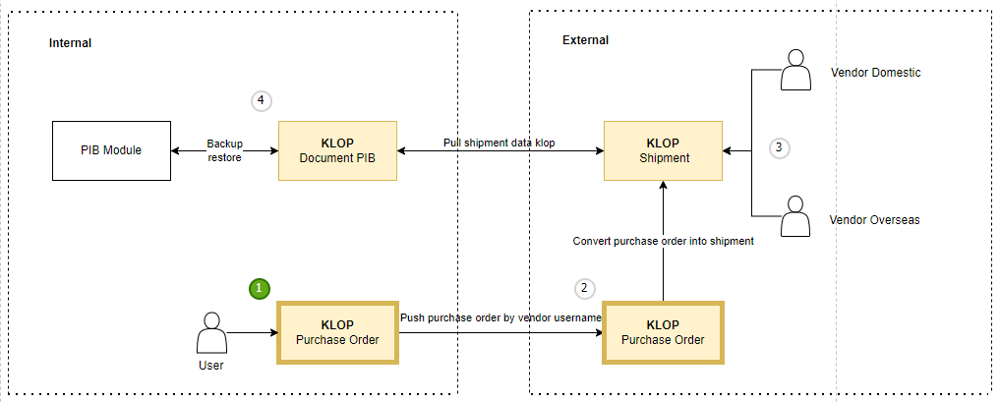

# Purchase Order

Saat ini Anda sedang berada di proses nomor 1, yaitu user **Internal** akan melakukan pembuatan **Purchase Order**, yang nantinya akan dikirimkan ke pihak **Eksternal** berdasarkan vendor yang dipilih.

# Pembuatan Purchase Order
Berikut ini adalah panduan untuk user **Internal** dalam melakukan pembuatan **Purchase Order**, ada 3 cara dalam melakukan pembuatan dokumen **Purchase Order**, yaitu sebagai berikut ini:
## Via API
Apabila user **Internal** sudah memiliki **ERP (*Enterprise Resource Planning*)**, maka user bisa mengirimkan informasi **Purchase Order** tersebut menggunakan **API** yang sudah disediakan pada **Klearance One Portal**, untuk panduan dalam menggunakan **API**[ klik disini](/overview/api)

## Via Impor
User **Internal** bisa melakukan pembuatan **Purchase Order** menggunakan unggah excel, untuk panduan dalam pembuatan dokumen **Purchase Order** via impor, user bisa [ klik disini](/klriuip/dokumeninternal/#import-file)

## Pembuatan Manual
User Internal bisa melakukan pembuatan **Purchase Order** secara manual, untuk panduan dalam pembuatan dokumen **Purchase Order** secara manual, user bisa [ klik disini](/klriuip/dokumeninternal/#manual)
