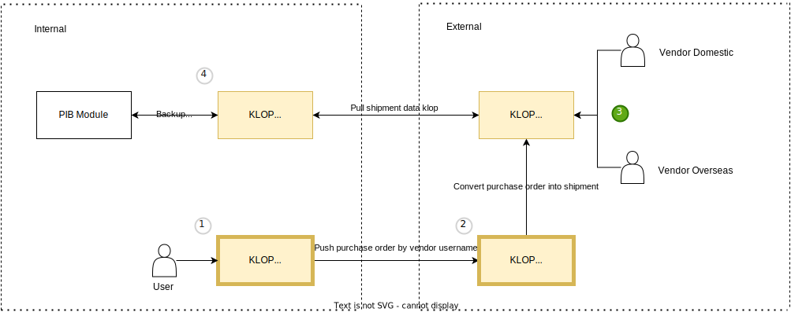

# Shipment

Saat ini anda sedang berada di proses nomor 3, setelah user **Internal** selesai melakukan pembuatan **Purchase Order**, berikutnya user **Eksternal** akan melakukan pembuatan dokumen **Shipment** atas **Purchase Order** yang telah dibuat oleh user **Internal**, berikut ini adalah panduan untuk user **Internal** dalam melakukan pengecekan dokumen **Shipment**, yaitu sebagai berikut:

## Pengecekan Status Dokumen
Ketika user **Eksternal** sedang memproses dokumen **Purchase Order** yang telah dibuat oleh user **Internal**, maka dokumen **Shipment** yang dibuat oleh pihak **Eksternal**, akan muncul pada menu **Shipment**, dan user **Internal** dapat melihat status dari dokumen **Shipment** tersebut beserta nomor **Purchase Order** yang digunakan, ada 3 status dokumen yaitu sebagai berikut:

|Status	|Deskripsi|
|:---------|:-----------|
| **Draft** | dokumen **Shipment** sudah dibuat atas nomor **Purchase Order** yang telah dibuat oleh user **Internal** |
| **Ready** | dokumen **Shipment** telah selesai dibuat & dilengkapi oleh user **Eksternal** |
| **Converted To Customs**| dokumen **Shipment** yang telah selesai dibuat & dilengkapi oleh user **Eksternal**, telah diconvert menjadi dokumen **PIB** |

## Melakukan Edit Dokumen
Ketika user **Eksternal** telah selesai melakukan pembuatan dokumen **Shipment**, dan sudah berstatus **Ready**, maka user **Internal** bisa melakukan revisi dokumen **Shipment** tersebut, apabila dokumen **Shipment** yang telah dibuat oleh pihak **Eksternal** telah terjadi kesalahan dalam pengisian data, untuk melakukan reveisi dokmen **Shipment**, yaitu sebagai berikut ini:

1. Klik menu **Transaction**
2. Pilih **Shipment**
3. Klik **Number Shipment** yang ingin direvisi
4. Klik tombol **Revisi**
5. Ubah data yang masih salah
6. Klik **Save**

:::info
Untuk data dokumen **Shipment** yang sudah direvisi, maka secara otomatis juga akan terefleksi pada dokumen **Shipment** pihak **Eksternal**
:::