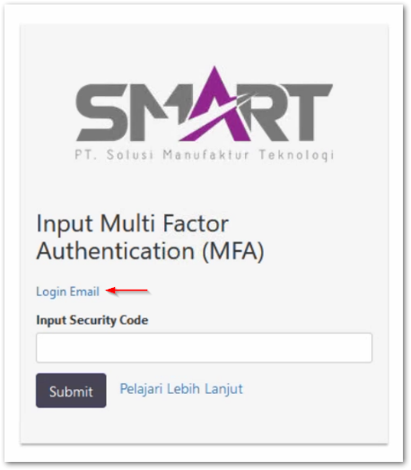

# 2 Factor Authentication
Seiring dengan berkembangnya perkembangan industri teknologi ada banyak sekali bentuk serangan digital yang dapat dilakukan oleh para peretas, salah satunya adalah melakukan aksi *brute force* dengan cara menebak kombinasi user dan password agar dapat masuk ke dalam sistem yang ingin diretas.

Atas dasar hal tersebut dibuat suatu metode pengamanan tambahan yang dinamakan 2FA atau 2 faktor autentikasi. 2FA merupakan salah satu metode pengamanan sistem untuk memvalidasi bahwa orang yang ingin mengakses sistem merupakan orang yang tepat.
Di mulai dari tahun 2022 sudah semakin banyak korporasi besar yang mewajibkan 2FA sebagai standar pengamanan yang harus diterapkan dalam setiap sistem perusahaan yang dapat diakses melalui internet publik.

Secara umum 2FA mewajibkan orang yang ingin masuk ke dalam sistem menggunakan dua metode validasi atau lebih. Dalam penerapan 2FA pada CDMS, CDMS mewajibkan dua metode validasi, yaitu:
1. Kombinasi username dan password
2. Kombinasi nomor dalam bentuk OTP (One Time Password) yang dikirimkan ke alamat email

## Masuk ke CDMS
1. Buka aplikasi CDMS melalui URL yang diberikan perusahaan pengguna fasilitas
2. Log in menggunakan username dan password yang telah diberikan untuk masuk ke dalam CDMS
3. Setelah berhasil akan muncul tampilan di bawah ini. Silahkan klik **Login Email**
   
4. Buka email menggunakan alamat email dan password yang sudah diberikan oleh perusahaan pengguna fasilitas kawasan berikat sebelumnya
5. Masukan kode unik yang terdapat pada inbox email tersebut ke halaman yang ada pada langkah 3
   
6. Anda akan dapat masuk ke dalam setelah berhasil memasukan kode unik pada email dengan tepat

