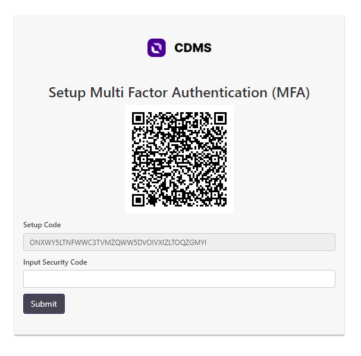

# 2 Factor Authentication
Seiring dengan berkembangnya perkembangan industri teknologi ada banyak sekali bentuk serangan digital yang dapat dilakukan oleh para peretas, salah satunya adalah melakukan aksi *brute force* dengan cara menebak kombinasi user dan password agar dapat masuk ke dalam sistem yang ingin diretas.

Atas dasar hal tersebut dibuat suatu metode pengamanan tambahan yang dinamakan 2FA atau 2 faktor autentikasi. 2FA merupakan salah satu metode pengamanan sistem untuk memvalidasi bahwa orang yang ingin mengakses sistem merupakan orang yang tepat.
Di mulai dari tahun 2022 sudah semakin banyak korporasi besar yang mewajibkan 2FA sebagai standar pengamanan yang harus diterapkan dalam setiap sistem perusahaan yang dapat diakses melalui internet publik.

Secara umum 2FA mewajibkan orang yang ingin masuk ke dalam sistem menggunakan dua metode validasi atau lebih. Dalam penerapan 2FA pada CDMS, CDMS mewajibkan dua metode validasi, yaitu:
1. Kombinasi username dan password
2. Kombinasi nomor dalam bentuk OTP (One Time Password) melalui aplikasi google authenticator

## Pengaturan Awal Google Auth
1. Download Google Authenticator (gauth) melalui link di bawah melalui ponsel  
[Android](https://play.google.com/store/apps/details?id=com.google.android.apps.authenticator2&hl=id&gl=US)  
[Apple](https://apps.apple.com/us/app/google-authenticator/id388497605)
2. Tanyakan username dan password yang digunakan untuk masuk ke dalam gauth kepada pihak perusahan pengguna fasilitas
::: info
Username selalu diakhiri dengan @gmail.com
:::
3. Masuk ke dalam gauth menggunakan kombinasi username dan password yang sudah diberikan pihak perusahaan pengguna fasilitas pada ponsel
4. Buka gauth

## Pengaturan Awal CDMS
1. Buka aplikasi CDMS melalui URL yang diberikan perusahaan pengguna fasilitas
2. Log in menggunakan username dan password yang telah diberikan untuk masuk ke dalam CDMS
3. Dalam melakukan pengaturan pertama kali akan muncul tampilan di bawah ketika sudah berhasil log in dengan username dan password
   
4. Buka gauth dan klik tanda tambah "+" pada pojok kanan bawah, kemudian pilih **Scan a QR code**
5. Arahkan ke ponsel ke QR Code dalam langkah 3
6. Masukan kode unik dalam bentuk 6 digit angka ke dalam CDMS IT Inventory

## 2FA CDMS
Setelah sukses melakukan pengaturan awal, maka setiap kali sukses masuk dengan username dan password, Anda diwajibkan membukan ponsel dan membuka aplikasi gauth untuk memasukan OTP dalam bentuk 6 digit angka
