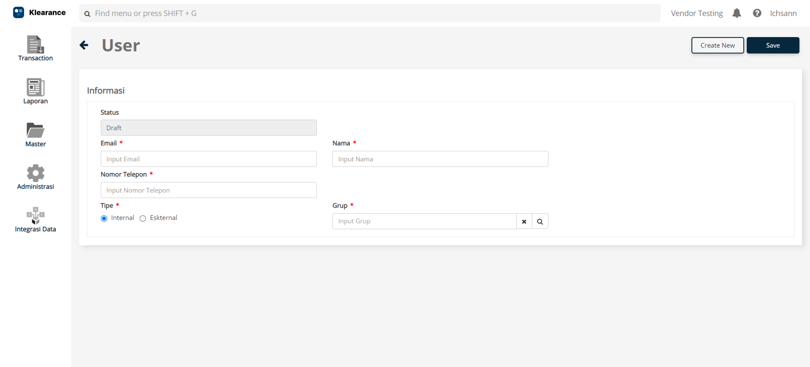
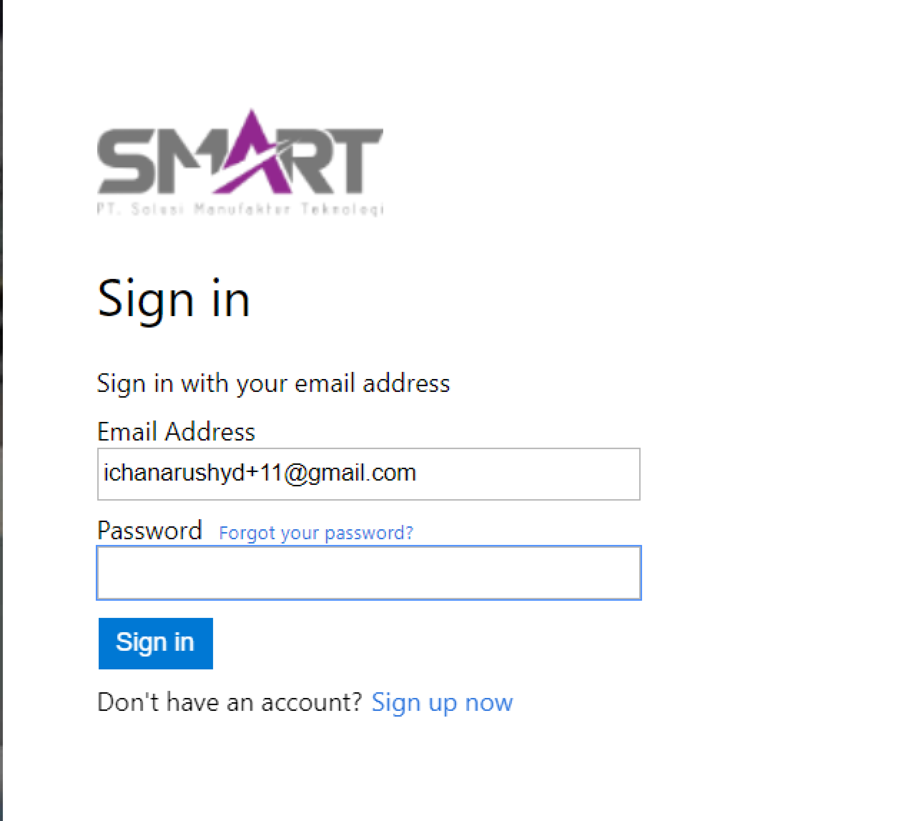
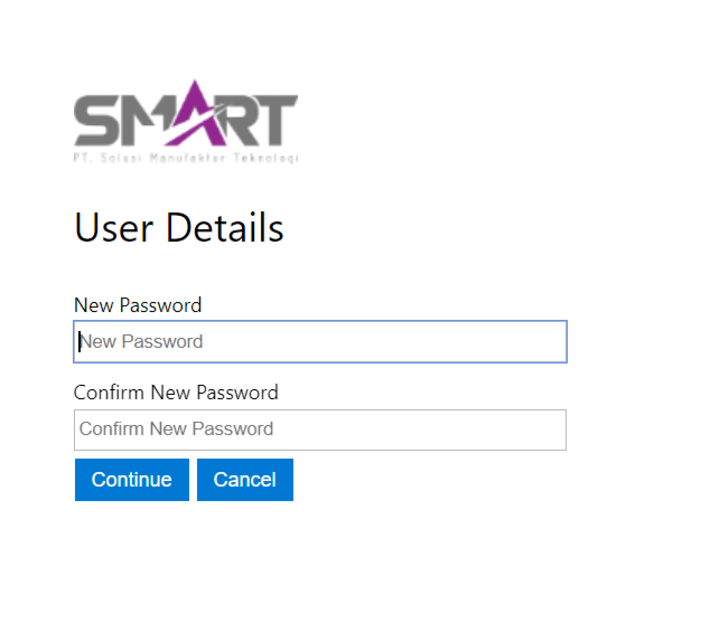
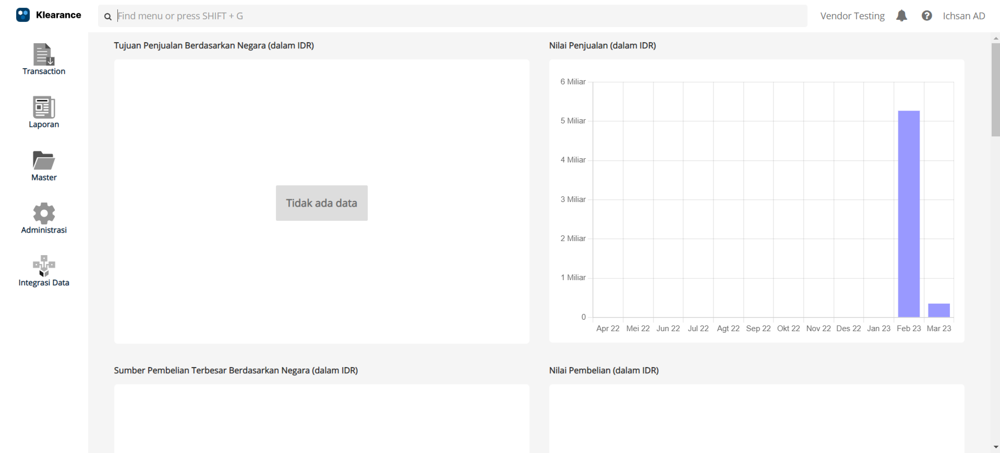

# Mengundang User
Panduan ini ada karena vendor yang memakai KLOP memiliki beberapa user didalamnya. Bila user lain ingin mengakses perusahaan di dalam KLOP, cukup 1 user (Super Admin) yang pertama kali mendaftarkan perusahaan pada KLOP untuk mengundangnya. Untuk mengundang user lain, Bapak Ibu bisa mengikuti panduan berikut ini:
<iframe width="560" height="315" src="https://www.youtube.com/embed/hrcr9pZAlA4" title="YouTube video player" frameborder="0" allow="accelerometer; autoplay; clipboard-write; encrypted-media; gyroscope; picture-in-picture; web-share" allowfullscreen></iframe>

## Langkah Mengundang User

### Super Admin
Bila Bapak Ibu ingin mengundang user ke dalam KLOP perusahaan, maka Bapak Ibu bisa mengikuti step - step berikut ini:
1. Bapak Ibu bisa klik <b>Administrasi</b> -> <b>User</b> -> <b>Create New</b>.

2. Kemudian isikan field yang perlu diisi:
    - <b>Email</b> yang ingin diundang
    - <b>Nama</b> user yang diundang
    - <b>Tipe</b> -> pilih <b>Internal</b>
    - <b>Grup</b> -> pilih <b>Administrator</b>
    - klik <b>Save</b>
3. Bila user sudah diundang ke dalam KLOP, email user yang diundang tadi akan mendapatkan email masuk di inbox.

### User yang Diundang
Berikut adalah langkah yang harus dilakukan oleh user yang diundang:
1. Buka email undangan dari Super Admin.

2. Isi pesan menjelaskan bahwa perusahaan sudah mengundang user ke dalam perusahaan KLOP-nya, serta mendapatkan <b>Temporary Password</b>.
3. Kemudian klik <b>Login</b>. Secara otomatis akan mendirect ke halaman <b>Sign In</b> KLOP.
4. Masukan email user -> klik <b>Continue</b>

5. Masukan <b>Temporary Password</b> pada field <b>Password</b> -> klik <b>Sign In</b>

6. Disini user diminta untuk memasukkan Password yang lebih baru. Masukan <b>New Password</b> dan <b>Confirm New Password</b>, kemudian klik <b>Continue</b>

7. Setelah menambah Password Baru, maka proses <b>Mengundang User</b> sudah selesai.