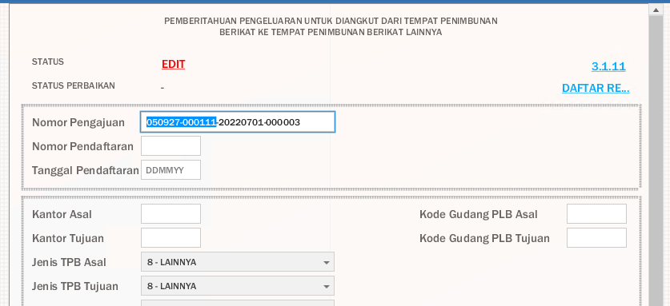
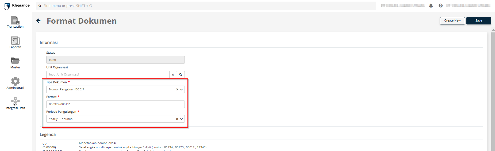
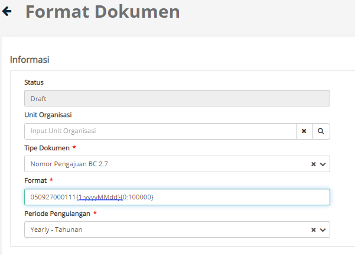
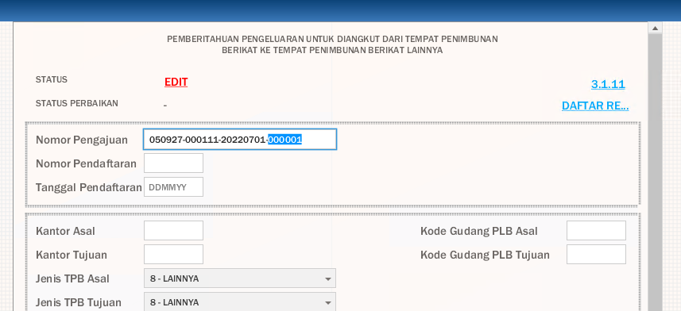
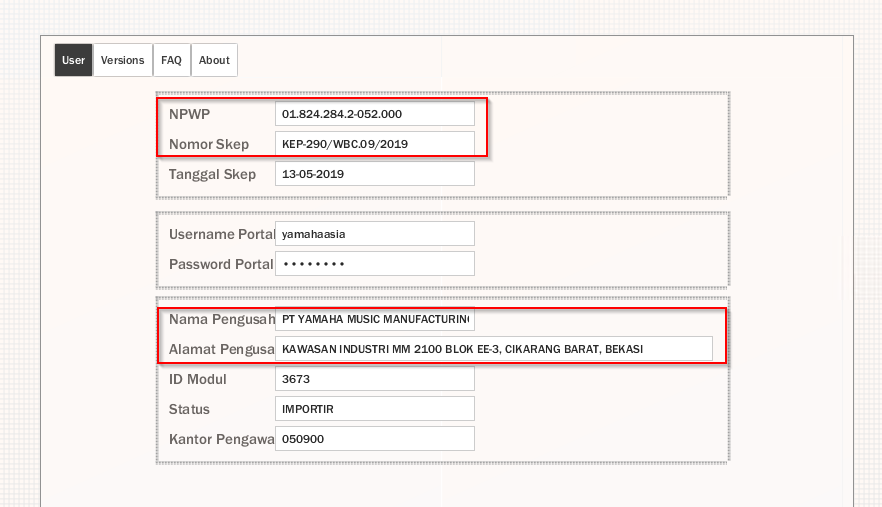

# Mengatur Akun
Sebelum dapat melakukan pembuatan BC 2.7, Anda diwajibkan untuk melakukan pengaturan akun terlebih dahulu

## Pengaturan Versi TPB & ID Module TPB
Untuk melakukan pengaturan versi TPB user bisa [klik disini](https://scribehow.com/shared/Klearance_Workflow__OWyPSlm-Q9K5resdfz7Z-w)

## Masukan format nomor aju
https://scribehow.com/shared/Create_Document_Format_Nomor_Aju__5FW8mNVTRHayNyQMt9e-tQ

Nomor aju merupakan nomor unik untuk mengidentifikasi setiap BC 2.7 secara unik

Buka nomor aju dan copy kan 12 digit pertama (seperti pada gambar) pada dokumen BC 27 TPB CEISA Anda

Silahkan buka klearance bagian <b>administrasi</b> pada side bar kemudian cari <b>format dokumen</b>

Klik <b>create new</b>

Paste yang sudah dicopy pada TPB CEISA ke dalam kolom format sehingga tampil seperti layar di bawah

hapus tanda baca setrip dan tambahkan kode di bawah
{1:yyyyMMdd}{0:100000}
sehingga tampilannya akan menjadi di bawah

## Pastikan nomor aju nya berbeda agar tidak bentrok dengan TPB CEISA

Running number pada nomor aju adalah 6 digit dari sebelah kanan.
Jika running number pada nomor aju perusahaan Anda dimulai dengan 000001, dengan melakukan pengaturan di atas maka dokumen BC 2.7 yang berasal dari klearance akan dimulai dengan running number 100001  

## Tarik semua master barang dari PO
https://scribehow.com/shared/Tarik_Master_Barang_Dari_PO__1w3bRkAfTvSN9Y5rkPd_nw

## Pastikan akun sudah sama dengan bagian about pada TPB CEISA

Masuk ke TPB CEISA perusahaan Anda kemudian cari menu <b>about</b>

Pastikan semua informasi yang di kotak merah pada gambar di atas sudah sama dengan yang ada di klearance bagian master akun.