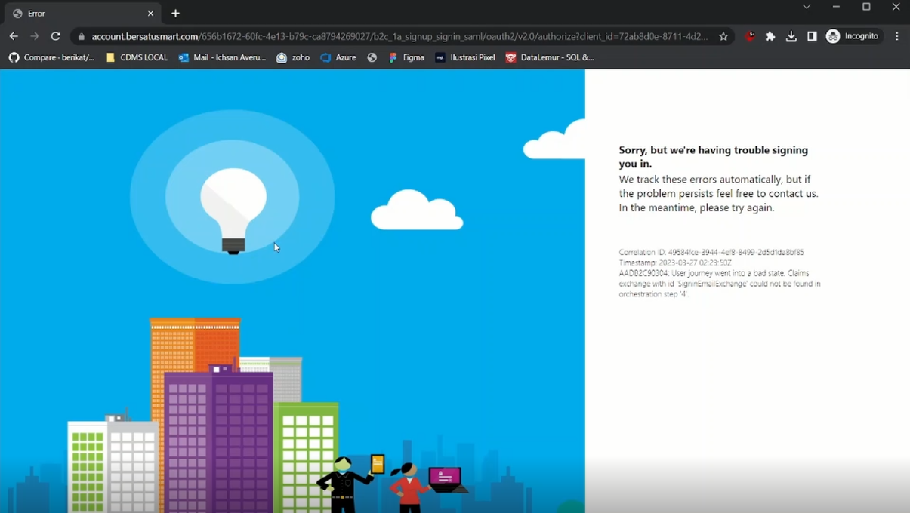

# FAQ's
Seluruh pertanyaan yang sering sekali ditanyakan akan dilampirkan di sini, mungkin ada pertanyan dari Bapak Ibu yang sudah ditanyakan, diharapkan pertanyaan dari Bapak Ibu bisa terjawab

## Apakah KLOP sudah terintegrasi dengan CEISA 4.0?
Sudah, KLOP sudah tersambung dengan CEISA 4.0, Bapak Ibu bisa membuat dokumen BC pada KLOP, dan untuk Validasi, Kirim Respond, Tarik Respon & Print sudah bisa dilakukan melalui KLOP

## Saat pendaftaran, bagaimana jika perusahaan saya GB?
Saat pendaftaran, jika perusahaan Bapak Ibu adalah GB, maka saat memilih Type bisa diisikan dengan KB

## Bagaimana jika saya memiliki perusahaan KB dan GB, apakah saya perlu mendaftarkan dua kali?
Tidak perlu, karena didalam KLOP sudah disediakan Unit Organisasi, yang dimana bisa digunakan untuk membedakan KB dan GB, untuk lebih jelasnya dalam menggunakan unit organisasi bisa [klik disini](https://www.youtube.com/watch?v=3ZEYmsYYtLc)

## Diperusahaan saya usernya ada banyak, bagaimana cara mereka menggunakan KLOP, apakah mereka harus membuat perusahaan juga?
Tidak perlu, karena cukup 1 user ( Super Admin) yang pertama kali mendaftarkan perusahaan pada KLOP bisa mengundang user lain untuk menggunakan KLOP, untuk cara mengundang user yang lain bisa [klik disini](https://www.youtube.com/watch?v=hrcr9pZAlA4)

## Apakah bahan baku yang Supplier buat bisa tidak diisi?, seperti yang kita ketahui untuk bahan baku adalah data kerahasian milik perusahaan, seharusnya pihak Customer tidak perlu mengetahui data tersebut
Sesuai validasi TPB CEISA untuk bahan baku memang harus terisi, namun Bapak Ibu tenang saja, dikarenakan untuk bahan baku yang Bapak Ibu lampirkan pada dokumen BC 2.7 Keluar tidak akan terlihat atau ditampilkan pada BC 2.7 Masuk Customer, dari sisi Customer hanya akan menerima Header, Detail, Dokumen, & Kemasan dokumen BC

## Bagaimana apabila deskripsi atau kode barang saya tidak sama dengan yang ada di PO Customer?
KLOP sudah memfasilitasi untuk kejadian seperti ini, untuk lebih detilnya Bapak Ibu bisa [klik disini](https://www.youtube.com/watch?v=6_WH7dB3dJE)

## Pembuatan BC saya masih manual, tetapi apakah saya harus tetap menggunakan KLOP? Apakah bisa nanti saya tetap bikin di TPB CEISA, lalu diimport saja dokumen BCnya?
Bisa, keputusan untuk pembuatan di KLOP ataupun TPB CEISA kita berikan kepada user, namun kita tetap menyarankan untuk melakukan pembuatan pada KLOP, dikarenakan apabila melakukan pembuatan pada KLOP, untuk pengisian Detail barang bisa otomatis terisi melalui data PO Customer, dan untuk pengisian Bahan Bakunya bisa menggunakan template, yang dimana akan sangat menghemat waktu dalam pembuatan dokumen BC

## Dokumen BC yang saya import ke KLOP ada kesalahan, dan sudah diperbaiki pada TPB CEISA, bagaimana cara memperbaiki dokumen yang sudah diimport ke KLOP?
Apabila kondisi ini terjadi, Bapak Ibu bisa mengikuti panduan berikut ini [klik disini](https://app.klearance.online/)

## Saat Sign In ke KLOP, terdapat Trouble pada Chrome saya. Bagaimana cara memperbaikinya?

Apabila kondisi ini terjadi, Bapak Ibu bisa mengikuti panduan berikut ini [klik disini](https://www.youtube.com/watch?v=X5EkJZLrrLc)

## Tidak Dapat Import Excel CEISA ke KLOP
Apabila Bapak Ibu tidak bisa import excel CEISA ke dalam KLOP, kami tetap menyarankan untuk melakukan pembuatan dokumen BC 2.7 pada KLOP. Untuk panduannya, Bapak Ibu bisa mengikuti panduan berikut ini [klik disini](https://www.youtube.com/watch?v=lutqfylUTRE)