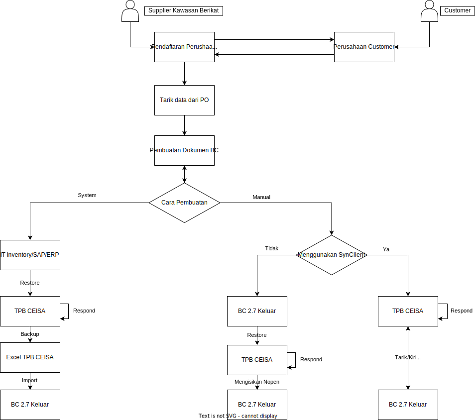
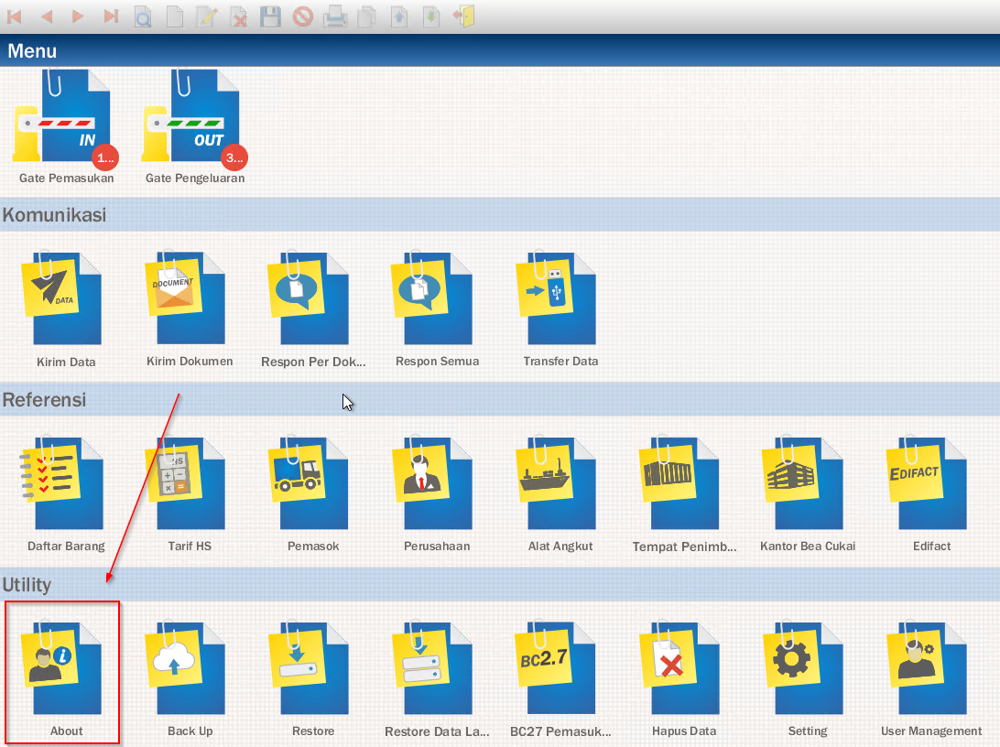

# Panduan Awal

## Pendaftaran
Sebelum menggunakan KLOP, maka setiap Customer ataupun Supplier, harus mendaftarkan perusahaannya pada KLOP terlebih dahulu. Untuk melakukan pendaftaran pada KLOP maka Bapak Ibu bisa mengikuti panduan dibawah ini:

<iframe width="560" height="315" src="https://www.youtube.com/embed/cgDFCgkECps" title="YouTube video player" frameborder="0" allow="accelerometer; autoplay; clipboard-write; encrypted-media; gyroscope; picture-in-picture; web-share" allowfullscreen></iframe>

:::info
Apabila perusahaan Bapak Ibu adalah GB, maka ketika pendaftaran tetap memilih KB, namun apabila perusahaan Bapak Ibu memiliki 2 yaitu KB & GB, maka Bapak Ibu bisa mengikuti tutorial video berikut ini: [klik disini](https://www.youtube.com/watch?v=Rvtj7zaURjo&feature=youtu.be)
:::

## Menyambungkan Perusahaan
Sebelum Bapak Ibu bisa menerima PO dari Customer atau mengirimkan PO ke Supplier, maka Bapak Ibu perlu menghubungkan perusahaan Bapak Ibu terleih dahulu.
### Supplier
Apabila perusahaan Bapak Ibu berperan sebagai Supplier, maka Bapak Ibu hanya perlu menunggu perusahaan Bapak Ibu sudah terhubung dengan Customer
:::info
Apabila perusahaan Bapak Ibu sudah terhubung dengan Customer, maka email yang didaftarkan sebagai perusahaan Bapak Ibu akan menerima notifikasi email apabila sudah terhubung dengan perusahaan Customer
:::

## Setup Akun
Setelah perusahaan Bapak Ibu berhasil terhubung dengan Customer, maka berikutnya Bapak Ibu bisa melakukan setup akun terlebih dahulu, ada beberapa informasi penting yang nantinya akan digunakan saat pembuatan BC 2.7

### Setup Id Modul & Versi TPB
Untuk melakukan pengaturan Id Modul & Versi TPB user bisa [klik disini](https://scribehow.com/shared/Klearance_Workflow__OWyPSlm-Q9K5resdfz7Z-w)

### Pastikan akun sudah sama dengan bagian about pada TPB CEISA

Masuk ke TPB CEISA perusahaan Anda kemudian cari menu <b>about</b>

## Pengecekan Customer PO
Pastikan Bapak Ibu, melakukan pengecekan pada menu Customer PO, untuk mengetahui PO yang terbaru dan PO mana saja yang masih belum diselesaikan. Untuk lebih lengkapnya Bapak Ibu bisa melihat video berikut ini:

<iframe width="560" height="315" src="https://www.youtube.com/embed/E_X_tV05XLk" title="YouTube video player" frameborder="0" allow="accelerometer; autoplay; clipboard-write; encrypted-media; gyroscope; picture-in-picture; web-share" allowfullscreen></iframe>

## Tarik Data Master Barang
Sebelum melanjutkan pembuatan BC 2.7 maka Bapak Ibu perlu mengisikan data Master Barang yang akan digunakan pada BC 2.7, namun ada kondisi dimana perusahaan Bapak Ibu memiliki Kode Barang Internal, sehingga untuk mengisikan data Master Barang terbagi menjadi 2 cara yaitu:

### Tarik Data Dari PO
Apabila Kode Barang Bapak Ibu sudah sama dengan Kode Barang milik Customer, maka Bapak Ibu bisa menggunakan Tarik Data Dari PO untuk mengisikan data Master Barang, dari data PO yang dibuat oleh Customer. Untuk cara melakukan Tarik Data Dari PO, Bapak Ibu bisa melihat video berikut ini:

<iframe width="560" height="315" src="https://www.youtube.com/embed/S_HqKXLeMGw" title="YouTube video player" frameborder="0" allow="accelerometer; autoplay; clipboard-write; encrypted-media; gyroscope; picture-in-picture; web-share" allowfullscreen></iframe>

### Tarik Data Dari Mapping
Apabila Kode Barang Bapak Ibu berbeda dengan Kode Barang milik Customer, maka Bapak Ibu harus berdiskusi terlebih dahulu dengan pihak Customer, agar pihak Customer bisa membuat Mapping Kode Barangnya, setelah data Mapping sudah dibuatkan oleh pihak Customer, maka secara otomatis data Kode Barang Internal Bapak Ibu akan muncul pada Master Barang, apabila Kode Barang Bapak Ibu masih belum muncul, maka Bapak Ibu bisa menggunakan tombol Tarik Data Dari Mapping. Untuk cara melakukan Tarik Data Dari Mapping, Bapak Ibu bisa melihat video berikut ini:

<iframe width="560" height="315" src="https://www.youtube.com/embed/6BigZ6OcYLk" title="YouTube video player" frameborder="0" allow="accelerometer; autoplay; clipboard-write; encrypted-media; gyroscope; picture-in-picture; web-share" allowfullscreen></iframe>

## Pembuatan BC 2.7
Sebelum melakukan Pembuatan BC 2.7 pada KLOP, ada 2 cara untuk melakukan pembuatan BC 2.7, yaitu sebagai berikut ini:

### System
Apabila **Bapak Ibu** sudah memiliki system berupa **IT Inventory/SAP/ERP** yang dapat mengerimkan data lansung ataupun restore ke **TPB CEISA**, maka Bapak Ibu bisa mengikuti step - step sebagai berikut ini:
1. **IT Inventory/SAP/ERP** mengirimkan & mengeluarkan **Excel Format TPB CEISA**
2. Kirim Respond pada **TPB CEISA**
3. Tarik Respond pada **TPB CEISA** untuk mendapatkan **Nomor & Tanggal Daftar**
4. Backup Dokumen **BC 2.7** tersebut
5. Restore Dokumen **BC 2.7** tersebut pada KLOP
<iframe width="560" height="315" src="https://www.youtube.com/embed/ALY2SCT_LOY" title="YouTube video player" frameborder="0" allow="accelerometer; autoplay; clipboard-write; encrypted-media; gyroscope; picture-in-picture; web-share" allowfullscreen></iframe>

6. Setelah Dokumen **BC 2.7** yang direstore muncul pada **KLOP**, maka proses pembuatan **BC 2.7** sudah selesai
:::warning
Apabila **Kode Barang Bapak Ibu** berbeda dengan **Customer**, maka segara hubungi pihak **Customer** untuk mendiskusikan mapping kode barangnya
:::

### Manual
Apabila **Bapak Ibu** melakukan pembuatan **BC 2.7** dengan cara pengisian manual di **TPB CEISA** ataupun Template yang nantinya akan direstore ke **TPB CEISA**, maka **KLOP** ini akan sangat membantu pembuatan dokumen **BC 2.7**, untuk cara pembuatan **Bapak Ibu** bisa mengikuti step - step berikut ini:
- Pengisian Header : [klik disini](https://scribehow.com/shared/Pembuatan_BC_27_Header__q90tF_DATIaTjplmrNWSYA)
- Pengisian Detail : [klik disini](https://scribehow.com/shared/BC_27_Add_Detail_Document__VcADzKvjSjqnjA0vpc9OWw)
- Pengisian Detail Melalui PO Customer, Menggunakan UI : [klik disini](https://www.youtube.com/watch?v=-Rpsc2_p4_M&feature=youtu.be)
- Pengisian Detail Melalui PO Customer, Menggunakan Template : [klik disini](https://www.youtube.com/watch?v=FQzeFsHpfME&feature=youtu.be)
:::info
Apabila perusahaan Bapak Ibu memiliki kondisi dimana Kode Barang sudah sama dengan PO, tetapi memiliki kondisi Deskripsi Barang berbeda, maka Bapak Ibu bisa edit deskripsi barangnya, dan diisikan dengan deskrispi barang customer + deskripsi barang internal Ex:
- Deskripsi Barang Customer: Resin 17A1
- Deskripsi Barang Internal: 17A1 Resin 17x1
- Maka penulisan deskripsi barangnya bisa diisikan dengan 'Resin 17A1 / 17A1 Resin 17x1', untuk panduan lengkapnya mohon ikuti video **Pengisian Detail Melalui PO Customer**
:::
- Pengisian Bahan Baku Template : [klik disini](https://www.youtube.com/watch?v=kBYfNKbBgus&feature=youtu.be)

