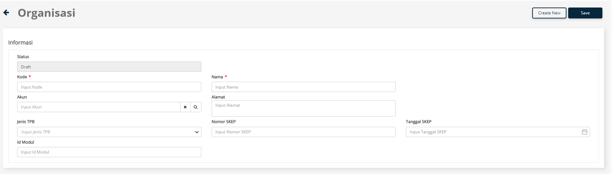

# Unit Organisasi
Apabila perusahaan Bapak Ibu memiliki KB & GB, maka Bapak Ibu bisa memanfaatkan menu Unit Organisasi yang ada pada KLOP, pada menu Unit Organisasi nanti Bapak Ibu akan mendaftarkan data akun yang memiliki perbedaan pada SKEP ataupun Idmodul
#
Berikut ini step-step yang harus dilakukan untuk mendaftarkan Unit Organisasi

## Step - Step:
1. Klik menu Master
2. Pilih Organisasi
3. Klik tombol Create New

4. Isikan Kode & Nama, bisa diisikan bebas, sesuai keinginan Bapak Ibu
- Ex Kode: AKUN001
- Ex Nama: PT. SOLUSI MANUFAKTUR KB
- Ex Akun: ACC01 ( Sesuai Kode Akun yang ada pada Master Akun)
- Ex Alamat: Jln. Kawasan MM2100 ( Sesuai data pada menu About TPB CEISA)
- Ex Jenis TPB: Kawasan Berikut
- Ex Nomor SKEP: KEP-244/WBC.09/2022
- Ex Tanggal SKEP: 08/12/2022
- Ex Id Modul: 78314

1. 