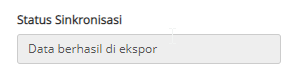

# TPB

## Setting Koneksi
Untuk menyambungkan module TPB dengan Klearance One Portal, user dapat menggunakan menu Sync Client, untuk melakukan setting Sync Client user dapat menuju [Sync Client](/klrkb/syncclient/)

## Module TPB
Untuk melakukan penyamaan user module TPB dengan Klearence One Portal, maka user dapat melakukan:
1. Pilih menu Master
2. Pilih Akun
3. Klik akun dengan kode ACC01
4. Pada bagian **Informasi** adalah seluruh info perusahaan yang harus disamakan dengan informasi pada **TPB**
5. Untuk mendapatkan informasi user pada TPB, user dapat membuka menu About 

## Mengirim Data ke TPB
Ketika user sudah selesai melakukan pembuatan dokumen BC 2.7 Out, maka user dapat mengirimkan data dokumen BC 2.7 tersebut langsung ke TPB, dengan cara sebagai berikut:
1. Pada dokumen BC 2.7 Out, klik tombol Submit
2. Status yang sebelumnya Draft akan menjadi Wait Approved
3. Klik tombol Kirim Data, pilih TPB
4. Maka proses pengiriman data tersebut dapat dilihat pada Status Sinkronisasi  menjadi
5. Ketika Status Sinkronisasi sudah berhasil diekspor, maka data tersebut sudah terkirim ke TPB module

## Update Sinkronisasi