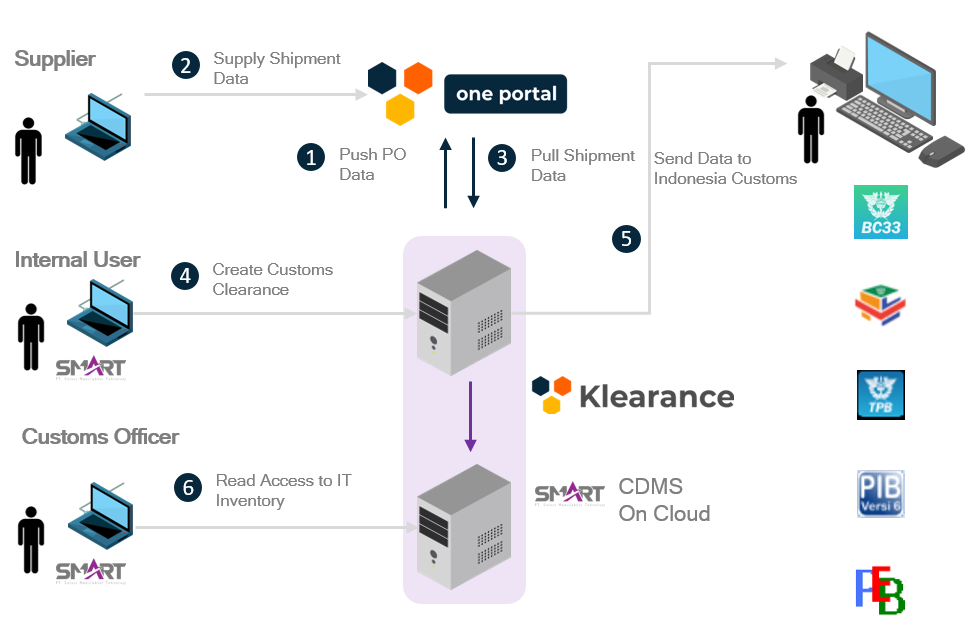
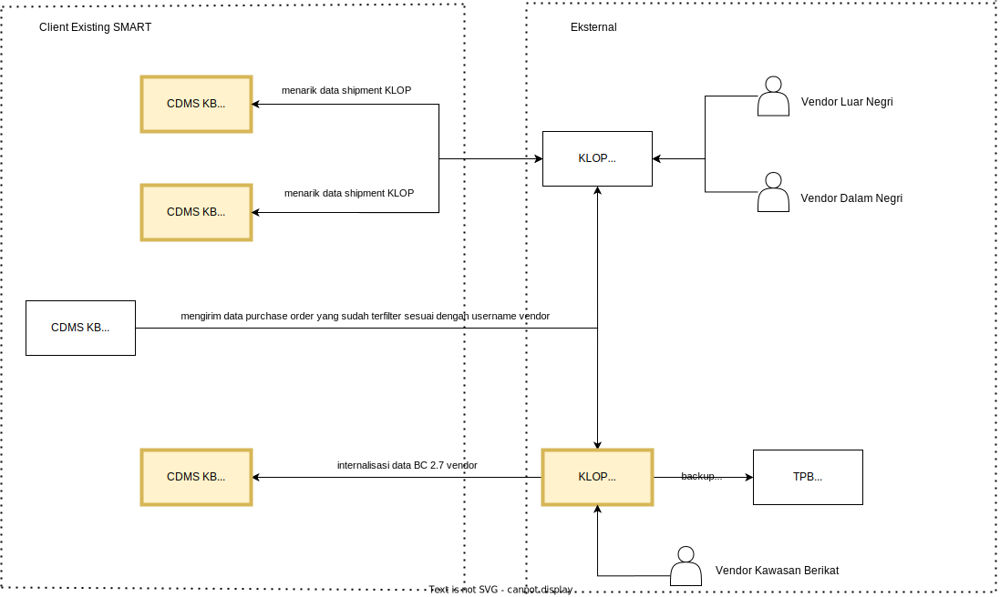

# Proses Kerja
Klearance One Portal akan berkolaborasi erat dengan CDMS Kawasan Berikat yang dimiliki perusahaan saat ini untuk mempermudah proses pembuatan dokumen kepabeanan dan memperbaiki tingkat akurasi data

## Klearance One Portal - CDMS KB

1. Supplier akan mendapatkan informasi Purchase Order yang sudah dikirimkan dari CDMS KB ke Klearance One Portal
2. Supplier akan memilih Purchase Order mana yang ingin diproses pengirimannya dan selanjutnya mengisi informasi pengiriman pada Klearance One Portal.
3. User internal perusahaan akan menarik data pengiriman ke dalam CDMS KB berikut dengan informasi penting lainnya.
4. User internal perusahaan dapat membuat dokumen kepabeanan di CDMS KB berdasarkan data pengiriman yang sudah dibuat supplier pada Klearance One Portal.
5. User internal melakukan pengiriman data dokumen kepabeanan 
6. Bea Cukai setempat dapat melakukan pengecekan IT Inventory perusahaan

## Klearance One Portal

1. Vendor Dalam Negeri akan melakukan pembuatan dokumen shipment pada KOP dan selanjutnya akan dikonversi menjadi BC 4.0 pada CDMS KB
2. Vendor Luar Negeri akan melakukan pembuatan dokumen shipment pada KOP dan selanjutnya akan dikonversi menjadi BC 2.3 pada CDMS KB
3. Vendor Kawasan Berikat akan membuat BC 2.7 pada KOP kemudian 
