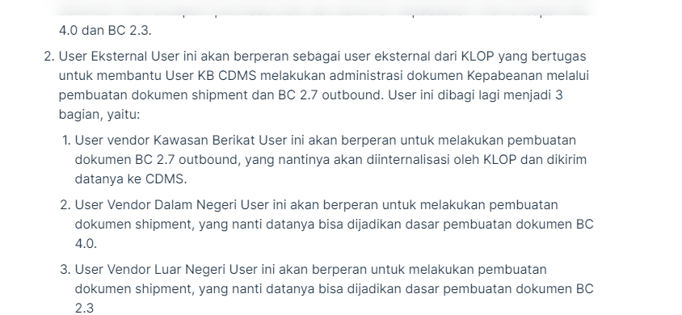

## Apa itu Klearance?
Klearance adalah aplikasi pelaporan Kepabeanan yang dapat digunakan untuk
1. Membuat berbagai macam dokumen Bea Cukai dengan akurat
2. Membuat laporan laporan penting Bea Cukai
3. Menyimpan seluruh dokumen Bea Cukai sampai dengan 10 tahun

## Manfaat
1. Memberikan validasi kode barang dengan memanfaatkan data ERP yang telah diintegrasikan
2. Melakukan pembuatan dokumen Bea Cukai secara semi otomatis dengan bantuan Purchase Order ataupun Invoice
3. Memberikan vendor portal Klearance One Portal yang dapat digunakan sebagai saran kontrol dokumen Purchase Order dan Shipment

## Apa itu Klearance One Portal?
Klearance One Portal (KLOP) akan terintegrasi dengan CDMS Kawasan Berikat yang dimiliki perusahaan untuk mempermudah proses pembuatan dokumen kepabeanan dan memperbaiki tingkat akurasi data.
Utamanya KLOP bertujuan untuk mempermudah perusahaan dalam melakukan pencatatan administrasi BC 2.7 masuk, BC 2.3, dan BC 4.0. Secara garis besar user Klearance One Portal akan dibagi menjadi 3, yaitu:
1. User KB CDMS
User ini akan berperan untuk melakukan pengecekan terhadap transaksi dokumen internal seperti purchase order dan dokumen kepabeanan internal seperti BC 4.0 dan BC 2.3.
2. User Eksternal 
User ini akan berperan sebagai user eksternal dari KLOP yang bertugas untuk membantu User KB CDMS melakukan administrasi dokumen Kepabeanan melalui pembuatan dokumen shipment dan BC 2.7 outbound. User ini dibagi lagi menjadi 3 bagian, yaitu:
    1. User vendor Kawasan Berikat
    User ini akan berperan untuk melakukan pembuatan dokumen BC 2.7 outbound, yang nantinya akan diinternalisasi oleh KLOP dan dikirim datanya ke CDMS.
    2. User Vendor Dalam Negeri
    User ini akan berperan untuk melakukan pembuatan dokumen shipment, yang nanti datanya bisa dijadikan dasar pembuatan dokumen BC 4.0.
    3. User Vendor Luar Negeri
    User ini akan berperan untuk melakukan pembuatan dokumen shipment, yang nanti datanya bisa dijadikan dasar pembuatan dokumen BC 2.3

## Skema KLOP

1. Untuk vendor Kawasan Berikat, mereka diwajibkan untuk membuat BC 2.7
2. 